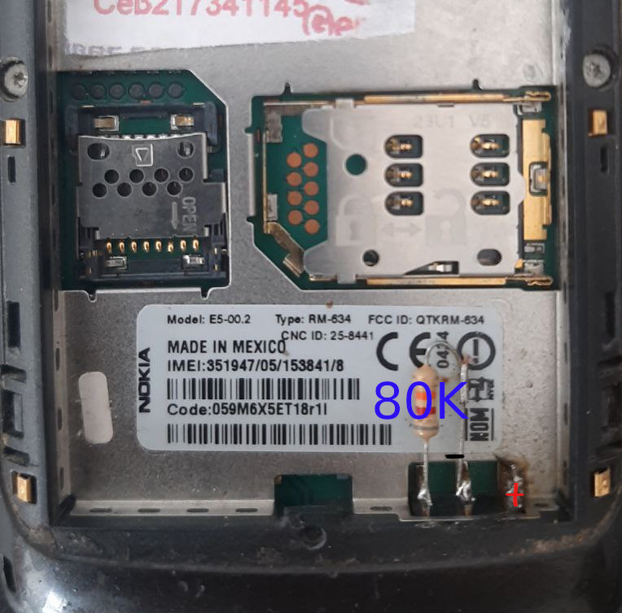

# Tree
Nokia e5/e63 Battery Hack

 Code for the display: mypys/ledv6.py
 Code for the server: pc/charserver

# s60
How to Build Compatible Python 2.5 2.6

 wget https://www.python.org/ftp/python/2.5.4/Python-2.5.4.tgz
sudo apt-get install zlibc zlib1g zlib1g-dev
install also libsasl2-dev and libssl-dev

sed -i "s/^#zlib/zlib/g" Modules/Setup

Then _sha256 is missing, which I fixed analogously to zlib as follows:

echo _sha256 sha256module.c >> Modules/Setup

While we are here _sha512 module can be enabled the same way:

echo _sha512 sha512module.c >> Modules/Setup

Then 
./configure --with-zlib=/usr/include --prefix=...
make
make install
 
Alternatively ((alternatively cd /lib and sudo ln -s ./x86_64-linux-gnu/libz.so.1 libz.so  && sudo ln -s ./x86_64-linux-gnu/libssl.so.1.1 libssl.so )
dor reconfigure & make

Source for troubleshooting Building python ver http://olegp.name/howto/build-python-25-with-modules/

Package to parent dir with 

python2.5 ensymble.py py2sis mypys/ledv3.py ..

